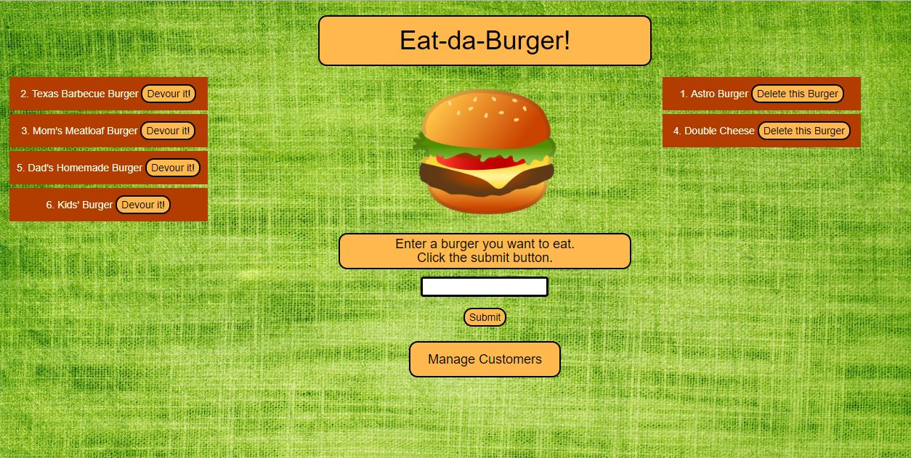
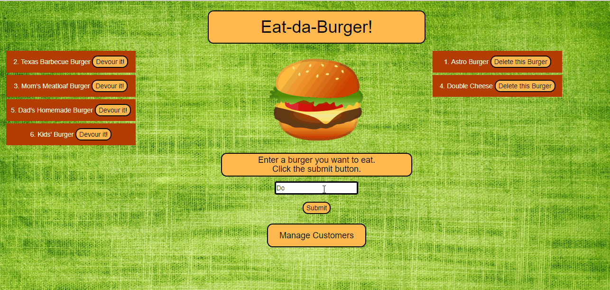
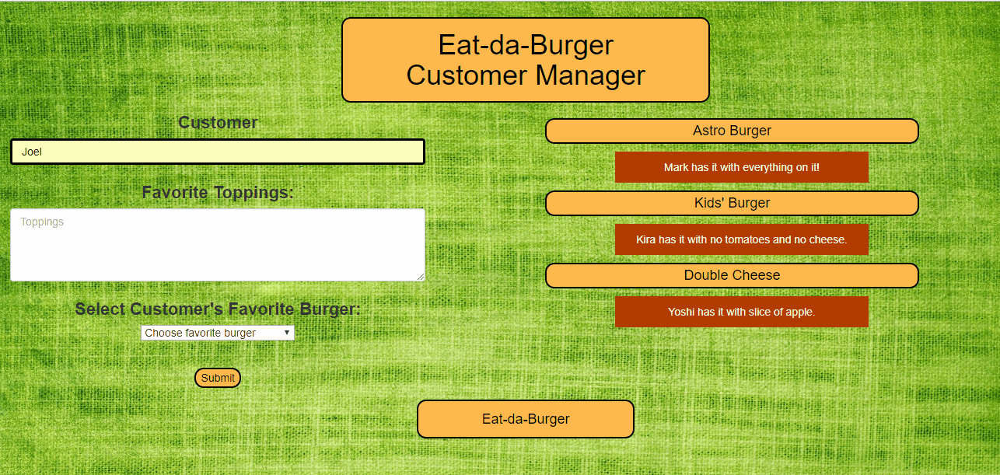
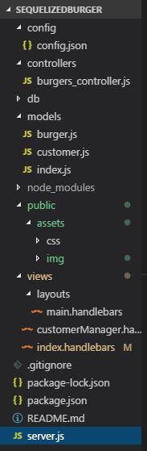

# Sequelized Burger  
### Restaurant app using Node, Express, Handlebars (Part 2)

This full-stack application displays a list of burgers from a database. If the burger has been eaten (in other words, if the stored 'devoured' column is set to 'true' for that burger), it is displayed on the right side of the page.  Otherwise the burger is displayed on the left. The devoured burger has a "delete" button,  which, when pressed, will remove the burger from the database.

### Changing Data

In the middle, there is a form area where the user can enter the name of another burger.  When submitted, 'devoured' is automatically set to false and the burger displays on the left side of the page.  This demonstrates the "create" or "insert" function of the CRUD model. When the client clicks on the 'Devour it!' button, the burger's 'devoured' column is set to 'true' in our database, and it appears on the right side of the page, demonstrating the "update" or "put" function.  A devoured burger can also be deleted, demonstrating the "delete" function of the CRUD model.

### Customer Page

This application uses two models, burger and customer.  The customer model "belongs" to the burger model.  On the customer page, the user can enter a customer, favorite toppings and a favorite burger.  The user must choose a burger that is in the database.  The burgers that are favorites of the customers are displayed on the right along with the customer's favorite toppings.  If the burger is deleted from the database, any customers for whom the burger is a favorite are also deleted.

### MVC Architecture

This application is a simple version of the MVC, or model-view-controller pattern.  The following is a screenshot of the structure of this application denoting the recommended architecture for the MVC model.  Sequelized-CLI is used to initialize the configuration (config.json) and models (index.js).  

##### About this Application

Sequelized Burger is deployed at: https://evening-lowlands-50069.herokuapp.com/. This repository is for a full stack JavaScript application, employing various technologies, including NPM packages (Express, Body Parser, Mysql2, Sequelize and Sequelize-cli), Handlebars templating, database handling, and styling with CSS. 
The application allows the client to interact with a server to submit and update data.  The burger data displays differently depending on its value in the 'devoured' column.  The user can easily add data to a burger table and a customer table. The application employs a simple client/server full-stack approach, with a front end (HTML-Handlebars, CSS), middleware (Express, Body-parser) and back end (ORM, models).  This project was created and is maintained by me, Marjika Howarth.
